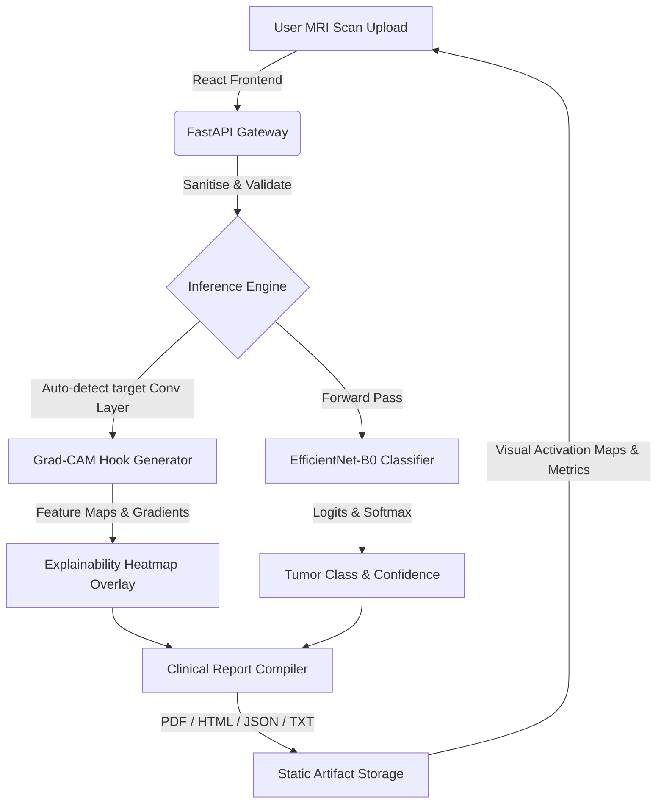

# NeuroVision-AI 🧠💻

NeuroVision-AI is an enterprise-grade, clinical-support decision system designed to automatically classify brain tumors from magnetic resonance imaging (MRI) scans and generate explainability overlays (Grad-CAM). 

The platform is designed with a decoupled **3-Tier Architecture** consisting of an AI/ML Training & Inference Engine, a FastAPI REST API Backend, and a React + TypeScript SPA Frontend.

---

## 🏗️ System Architecture & Data Flow



---

## 📁 Repository Structure

```
NeuroVision-AI/                                  # Repository Root
│
├── .gitignore                            # Root gitignore
├── README.md                             # Project overview and run guide
│
├── ml/                                   # AI/ML Training & Inference Layer
│   ├── config.py                         # Centralised configuration and hyper-parameters
│   ├── dataset.py                        # Custom PyTorch Dataset with md5 de-duplication
│   ├── dataloader.py                     # DataLoader generation factory
│   ├── preprocess.py                     # Preprocessing transformations and scanner
│   ├── train.py                          # Classifier training runner
│   ├── predict.py                        # Production CLI predictor
│   ├── main.py                           # End-to-end dataset validation runner
│   ├── seed.py                           # Deterministic reproducibility seeds
│   ├── device.py                         # Hardware device configuration (CUDA/CPU)
│   ├── visualize.py                      # Training & preprocessing visualization
│   ├── reports.py                        # Dataset analytics report compiler
│   ├── validators.py                     # Raw image structural validator
│   ├── artifacts.py                      # Training output directory manager
│   ├── utils/                            # General & image utilities
│   ├── requirements.txt                  # ML layer dependencies
│   │
│   ├── models/                           # Neural network backbones
│   │   ├── __init__.py
│   │   └── efficientnet.py               # Custom EfficientNet-B0 Classifier
│   │
│   ├── training/                         # Core training implementation
│   │   ├── __init__.py
│   │   ├── trainer.py                    # PyTorch Trainer class
│   │   ├── optimizer.py                  # Optimizer factory
│   │   ├── scheduler.py                  # LR scheduler factory
│   │   ├── losses.py                     # Loss functions factory
│   │   ├── metrics.py                    # Metric calculations (Accuracy, F1-macro)
│   │   ├── checkpoint.py                 # Checkpoint manager (Save/Resume)
│   │   └── callbacks.py                  # Early stopping and history logger
│   │
│   ├── inference/                        # Core production inference engine
│   │   ├── __init__.py
│   │   ├── inference_engine.py           # Single-image orchestrator
│   │   ├── predictor.py                  # Singleton Predictor wrapper
│   │   ├── preprocess_single.py          # Single scan preprocessor
│   │   ├── postprocess.py                # Logits to class probabilities mapping
│   │   ├── model_loader.py               # Model structure and weight loader
│   │   ├── validator.py                  # Upload validation
│   │   ├── probabilities.py              # Softmax probability extractor
│   │   ├── response.py                   # Type-safe prediction schemas
│   │   └── exceptions.py                 # Custom inference exceptions
│   │
│   ├── evaluation/                       # Performance evaluation
│   │   ├── __init__.py
│   │   └── evaluate.py                   # Custom evaluator for test split
│   │
│   ├── explainability/                   # Explainable AI (XAI)
│   │   └── utils.py                      # Grad-CAM conv hooks and utilities
│   │
│   ├── report/                           # Clinical report generation schemas
│   │   └── metadata.py                   # Clinical metadata definitions
│   │
│   └── artifacts/                        # Output artifacts directory
│       └── checkpoints/                  # Saved weights (best_model.pth)
│
├── backend/                              # FastAPI REST API Backend
│   ├── .env.example                      # Template config environment file
│   ├── requirements.txt                  # Backend-specific package requirements
│   │
│   ├── app/                              # Application source code
│   │   ├── main.py                       # FastAPI entrypoint
│   │   ├── dependencies.py               # DI services accessor
│   │   ├── exceptions.py                 # Custom API exception handlers
│   │   │
│   │   ├── config/                       # Settings and Logger
│   │   │   ├── settings.py               # Pydantic Settings
│   │   │   └── logging.py                # Application-wide logger configuration
│   │   │
│   │   ├── middleware/                   # CORS and logging middleware
│   │   ├── services/                     # Prediction, Grad-CAM, and Report services
│   │   ├── schemas/                      # API response schemas
│   │   ├── api/                          # REST Endpoint Controllers (V1)
│   │   │   └── v1/
│   │   └── utils/                        # File and folder utilities
│   │
│   └── uploads/                          # Temporary directory for uploaded scans
│
├── frontend/                             # React + Vite Client (TS)
│   ├── vite.config.ts                    # Vite config
│   ├── package.json                      # Frontend scripts and dependencies
│   ├── index.html                        # HTML entry point
│   ├── src/                              # Source code (Components, Pages, Stores)
│   └── public/                           # Static assets
│
└── docs/                                 # Documentation
    └── dataset.md                        # Dataset structure and details
```

---

## 🛠️ Technology Stack & Frameworks

### 1. Machine Learning Layer (AI Layer)
- **Deep Learning Framework**: `PyTorch` (torch >= 2.0.0) — provides GPU-accelerated tensor computations and autograd mechanics.
- **Model Backbone**: `Torchvision` — imports the EfficientNet-B0 architecture pretrained on the `ImageNet1k` dataset.
- **Image Manipulation**: `Pillow` (PIL) & `OpenCV-python` — handles loading, format conversions, bilinear resizes, and color map conversions.
- **Scientific Computing**: `NumPy` — handles matrix mathematical transformations and image arrays conversions.
- **Visualisation**: `Matplotlib` — generates metrics curves, confusion matrices, and dataset previews.

### 2. Backend REST API
- **Web Framework**: `FastAPI` (ASGI) — high-performance, asynchronous REST framework with automatic OpenAPI/Swagger documentation generation.
- **Application Server**: `Uvicorn` — lightning-fast ASGI server implementation.
- **Data Validation**: `Pydantic` (v2) — parses and validates JSON request and response payloads with type hints.
- **Config Management**: `Pydantic-Settings` — loads and parses configurations from environment variables.
- **Report Generation**: `ReportLab` — compiles analysis results and heatmaps into professional Clinical PDF reports.

### 3. Frontend SPA Client
- **Core Library**: `React` (v19) — handles component-driven SPA rendering.
- **Build Tool**: `Vite` — rapid frontend building and hot module replacement.
- **Language**: `TypeScript` — compile-time type-checking.
- **State Management**: `Zustand` — simple, fast, and scalable global state container.
- **Server State**: `TanStack React Query` — handles asynchronous API caching, loading states, and updates.
- **Styling**: `Vanilla CSS` — custom premium UI design tokens, grid patterns, glassmorphic headers, and dark-mode aesthetic controls.
- **Animations**: `Framer Motion` — handles micro-animations and page transition effects.
- **Icons**: `Lucide React` — premium medical and workflow vectors.

---

## 🧬 Machine Learning Pipeline Technical Specifications

### 1. Preprocessing and Augmentation Strategy
The raw T1/T2/FLAIR MRI scans are normalized and transformed dynamically inside the PyTorch Dataset:
- **Resizing**: Scaled to `540` using bilinear interpolation to retain boundary textures.
- **Cropping**: A random `512×512` crop is applied during training (and a center `512×512` crop during evaluation) to keep the target region focused.
- **Normalization**: Normalized to ImageNet standards (`mean=[0.485, 0.456, 0.406]`, `std=[0.229, 0.224, 0.225]`).
- **Data Augmentation**: To prevent overfitting, the training loader applies random horizontal flips, random rotations (up to 15°), random affine translations/shears, color jittering (brightness & contrast adjustments), and Gaussian noise.

### 2. Deduplication and Leakage Prevention
- **MD5 Fingerprinting**: To avoid data contamination (e.g. augmented copies or duplicate vendor images across training/test sets), every image is hashed.
- **Deduplication**: Byte-identical duplicates are identified. Only one instance is kept, and the rest are moved to `ml/artifacts/duplicates/`.
- **Partition Verification**: The system checks if identical image hashes exist between splits. If any cross-split leakage is detected, the pipeline halts immediately.

### 3. Neural Architecture & Optimization
- **Model Backbone**: `EfficientNet-B0` — selected for its high parameter efficiency and lightweight footprint.
- **Classifier Head**: Replaced with a Sequential head containing a `Dropout(p=0.5)` layer and a `Linear(in_features=1280, out_features=4)` projection layer.
- **Loss Function**: Weighted Cross-Entropy Loss (weights are computed using inverse-frequency of class occurrences to counteract imbalance).
- **Optimization**: `AdamW` optimizer (learning rate: `1e-4`, weight decay: `1e-2`).
- **Scheduling**: ReduceLROnPlateau or Cosine Annealing learning rate schedules.
- **Precision**: Automatic Mixed Precision (`torch.cuda.amp.autocast`) with `GradScaler` to accelerate training on compatible CUDA GPUs.

---

## 🚀 Setup & Execution Guide

### 1. Preprocessing and Training (ML Layer)
First, make sure you have the raw brain tumor dataset placed in `Brain Tumor Detection from MRI/` under the repository root.

```bash
# Navigate to the ML module
cd ml

# Install ML requirements
pip install -r requirements.txt

# Run the end-to-end dataset scan and validation pipeline
python main.py

# Run the classifier training
python train.py
```

### 2. REST API Backend (FastAPI)
The backend loads the model weights saved in `ml/artifacts/checkpoints/best_model.pth` and exposes REST endpoints.

```bash
# Navigate to the backend directory
cd backend

# Install API requirements
pip install -r requirements.txt

# Copy and configure environment variables
copy .env.example .env

# Run backend development server (starts at http://127.0.0.1:8000)
# Make sure to run this command from the NeuroVision-AI root directory
# (e.g., cd .. then uvicorn backend.app.main:app --reload)
uvicorn backend.app.main:app --reload
```
Interactive API documentation is available at `http://127.0.0.1:8000/docs`.

### 3. Web Client Interface (React + TypeScript)
The frontend communicates with the FastAPI server to process scans and display Grad-CAM heatmaps.

```bash
# Navigate to the frontend directory
cd frontend

# Install Node packages
npm install

# Run the React development server
npm run dev
```

---

## 📊 Preprocessing & Model Training Analytics

This section showcases the diagnostic visualizations generated by the preprocessing and training pipeline, illustrating the dataset structure, augmentations, and final model performance.

### 📷 Data Preprocessing Visualizations

#### 1. Dataset Class Samples
Typical brain MRI scan samples from the four target categories: Glioma, Meningioma, No Tumor, and Pituitary.


#### 2. Class Distribution
Analysis of class frequencies across the entire dataset. The dataset is balanced, ensuring robust training without skew.


#### 3. Preprocessing Comparison (Original vs Preprocessed)
Original raw scan compared with its processed version (resized to 512×512, normalized, and normalized to ImageNet statistics).


#### 4. Data Augmentation Previews
Previews of training augmentations applied dynamically (random rotation, affine translation, horizontal flipping, and random crops).


#### 5. DataLoader Batch Preview
A visual representation of a single training batch tensor loaded by the PyTorch DataLoader, ready for forward propagation.


---

### 📈 Model Training & Evaluation Performance

#### 6. Training and Validation Loss Curves
Tracking training and validation cross-entropy loss values over training epochs. Decline indicates proper weight convergence.


#### 7. Training and Validation Accuracy Curves
Accuracy metrics over training epochs, tracking progression of general classification performance.


#### 8. Learning Rate Schedule Decay
The learning rate step decay schedule used by the Optimizer (e.g., Cosine Annealing or ReduceLROnPlateau).


#### 9. Final Training Epoch Confusion Matrix
Classification breakdown on the training set, illustrating class sensitivity during the final epoch.


#### 10. Unseen Test Split Confusion Matrix
The final test split performance breakdown. This proves generalization capabilities on completely unseen medical scans.


---

## 🧬 Supported Tumor Classifications
The model classifies brain MRI scans into one of four categories:
1. **Glioma**: Primary brain tumor originating from glial cells.
2. **Meningioma**: Tumor developing in the membranes surrounding the brain.
3. **Pituitary**: Tumor developing in the pituitary gland.
4. **No Tumor**: Normal, healthy brain scans.
